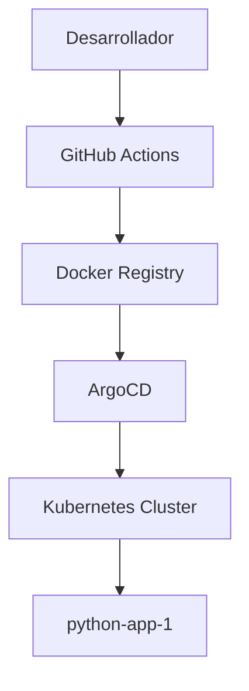

# 🏗️ Arquitectura y Despliegue

## Diagrama General



## Componentes Clave

- **Flask App**: API REST y UI
- **Helm Chart**: Despliegue flexible en K8s
- **Ingress**: Exposición HTTP (python-app-1.test.com)
- **ArgoCD**: GitOps y sincronización automática
- **GitHub Actions**: CI/CD, build/push Docker, sync ArgoCD

---

# 📦 Estructura de Carpetas

```
python-app-1/
├── charts/                # Helm chart
├── src/                   # Código fuente Flask
├── templates/             # UI Jinja2
├── k8s/                   # Manifiestos legacy
├── .github/workflows/     # CI/CD
├── docs/                  # Documentación
├── Dockerfile             # Imagen Docker
├── requirements.txt       # Dependencias
└── README.md
```
